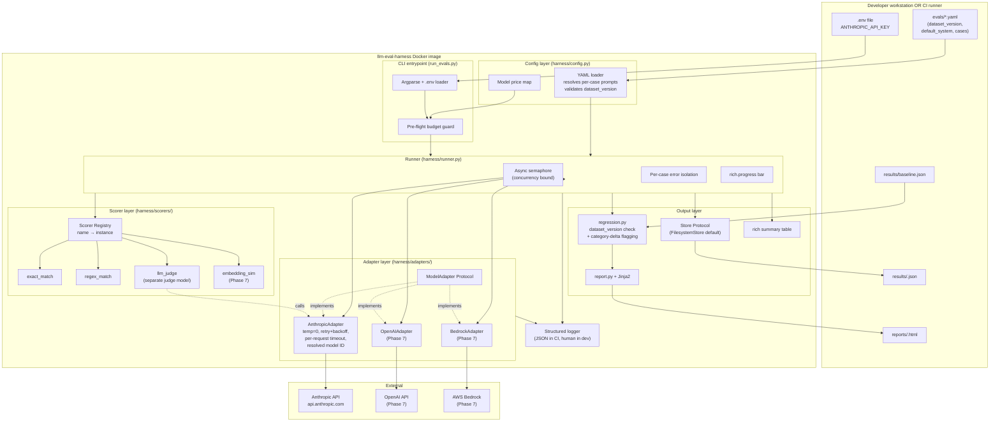
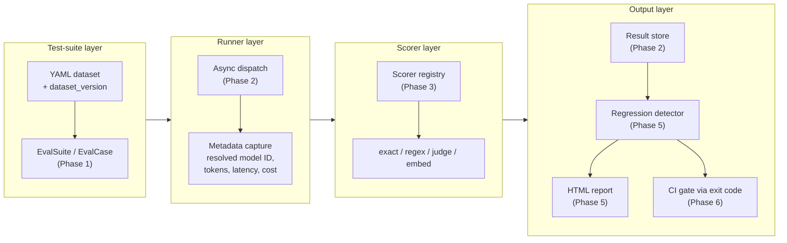
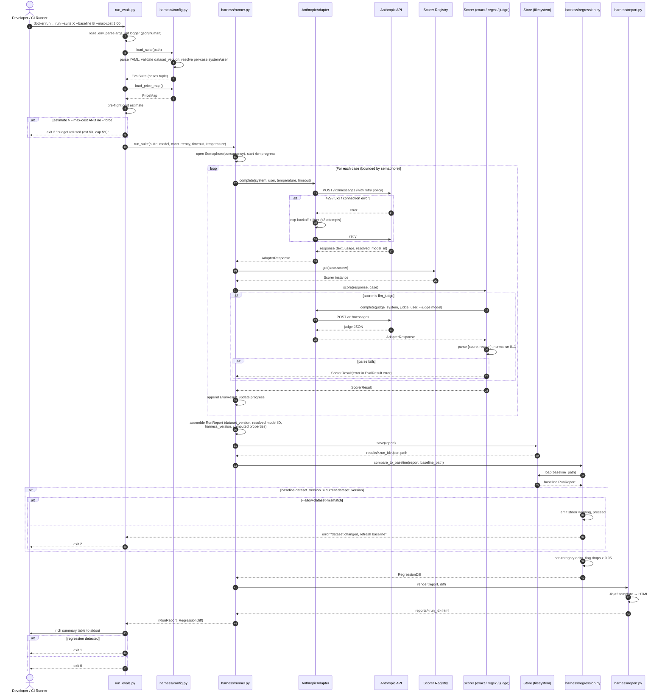

# llm-eval-harness — System Design

**Author:** Nadia Reyes (Principal Engineer)
**Date:** 2026-06-08
**Status:** Design v1 — anchored on `project_plan.md` AI-423 (Epic) → AI-431
**Audience:** the engineer building this (you), code reviewers, future portfolio readers

---

## 1. The Brief

`llm-eval-harness` is a **versioned, CI-gated test suite for LLM features**. A developer points it at a YAML suite of cases and a model, it runs them concurrently, scores the outputs with pluggable scorers, compares against a stored baseline, and emits a pass/fail verdict plus an HTML report. The artifact is a CLI tool — not a service — but shipped as a multi-arch Docker image so anyone can run it (or wire it into CI) without a Python install.

This is a portfolio project. "Production grade" here means: reproducible builds, deterministic runs, type-strict code, retry/timeout/budget guards on external calls, structured logs, an HTML artifact, and a containerised distribution. It does **not** mean a 99.99% multi-region SaaS.

---

## 2. Requirements

### Functional

- Load a versioned YAML eval suite (`EvalSuite{dataset_version, default_system, default_user, cases}`)
- Dispatch each case asynchronously to a model under test via a `ModelAdapter`
- Score each response via a registry-resolved `Scorer` (`exact_match`, `regex_match`, `llm_judge`, optional `embedding_sim`)
- Persist a `RunReport` as JSON
- Compare to `results/baseline.json`; flag any category with `pass_rate` drop > 0.05
- Refuse cross-`dataset_version` comparisons unless `--allow-dataset-mismatch`
- Render an HTML report (`reports/<run_id>.html`)
- Exit non-zero on regression so CI can gate merges
- (Stretch) Run a suite against two models and emit a side-by-side comparison report

### Non-functional (with numbers — these are the bounds the design is built for)

| Dimension | Target | Notes |
|---|---|---|
| Suite size (typical) | 10–200 cases | Portfolio + dev-loop use |
| Suite size (max) | 5,000 cases | Power-user ceiling |
| Concurrency | 1–20 in-flight requests | Bounded by `--concurrency` |
| Per-case latency budget | 60s default (configurable via `--timeout-seconds`) | Hard kill — case marked `error`, run continues |
| Run wall-clock (typical) | 30s–5min | Dominated by LLM I/O |
| Cost ceiling per run | `--max-cost USD` (e.g. $5) | Pre-flight refusal if estimate exceeds |
| Result storage growth | ~50 KB per `RunReport` | 10k runs ≈ 500 MB — filesystem is fine |
| Test-suite runtime | < 5s | All offline, mocked |
| `mypy --strict` time | < 10s | Small codebase |
| Cold-start CLI invocation | < 1s | Includes config load + price map |
| Docker image size | < 200 MB compressed | `python:3.12-slim` base |
| Portability | macOS dev + Linux CI + ARM64 + AMD64 | Multi-arch image |

### Out of scope (explicit — kills scope creep)

- Real-time inference / serving traffic
- Multi-tenant SaaS, multi-user authn/z
- A web UI for triggering runs (the CLI is the interface)
- Streaming responses from the model (we score final output only)
- Multi-turn / tool-use evaluation
- A managed dataset hub (datasets live in the repo as YAML)
- Storing PII — input/output content is whatever the user puts in cases; we do not classify
- Real-time alerting infrastructure — alerts come from CI failing the build

---

## 3. Capacity Estimation

**Per-run cost (Anthropic Sonnet 4.6, approximate):**

```
typical case: ~500 input tokens, ~200 output tokens
sonnet 4.6: $3/M input, $15/M output
per case: (500 * 3 + 200 * 15) / 1_000_000 = $0.0045
100-case suite: ~$0.45
With llm_judge layered on top (judge call per case): ~2x → ~$0.90
5000-case power-user suite with judge: ~$45 — flag via --max-cost
```

**Per-run wall-clock:**

```
100 cases, concurrency=10, mean latency 2s per call:
  ceil(100 / 10) * 2 = 20s for model calls
  + scoring (fast) + report rendering (fast) → ~25–30s end-to-end
With retries (~5% rate): +1–2s
```

**API rate-limit headroom (Anthropic):**

```
Tier 2: 1000 RPM ≈ 16.6 RPS. With concurrency=10 and 2s/case → 5 RPS sustained. Comfortable.
Tier 1: 50 RPM ≈ 0.83 RPS. concurrency must drop to ~2.
Detection: 429 → exponential backoff with jitter, max 3 attempts.
```

**Result storage:**

```
1 RunReport JSON ≈ 30 KB (100 cases × ~300 bytes each + metadata)
1000 runs ≈ 30 MB. Filesystem is fine indefinitely.
At 100k runs (which we will never hit) → 3 GB; that's when you graduate to SQLite + S3.
```

**Docker image footprint:**

```
python:3.12-slim base: ~50 MB
uv-installed deps (anthropic, pyyaml, rich, jinja2, etc.): ~80 MB
harness code: ~1 MB
Total: ~130 MB compressed. Well under the 200 MB budget.
```

---

## 4. Interface Surfaces

### 4.1 CLI (the primary interface)

```
llm-eval-harness run \
  --suite evals/summarisation.yaml \
  --model claude-sonnet-4-6 \
  --judge claude-haiku-4-5 \           # only used when llm_judge scorer present
  --concurrency 10 \
  --timeout-seconds 60 \
  --temperature 0 \
  --max-cost 1.00 \
  --baseline results/baseline.json \
  --output-dir results/ \
  --report-dir reports/ \
  --log-format human                   # or 'json' for CI

# Sub-commands
llm-eval-harness run        # run a suite
llm-eval-harness baseline   # convenience: --update-baseline shorthand
llm-eval-harness compare    # Phase 7: --compare model_a,model_b
llm-eval-harness lint       # validate a YAML suite without running it
llm-eval-harness version    # print harness_version + Python + adapter versions
```

**Exit codes**

| Code | Meaning |
|---|---|
| 0 | All cases scored, no regression |
| 1 | Regression detected against baseline |
| 2 | Config / suite validation error (missing dataset_version, unknown scorer, malformed YAML) |
| 3 | Pre-flight budget refusal |
| 4 | Catastrophic adapter failure (no cases completed) |

### 4.2 Library surface (importable from `harness`)

```python
from harness import load_suite, run_suite, compare_to_baseline, render_html_report

suite = load_suite("evals/summarisation.yaml")
report = await run_suite(suite, model="claude-sonnet-4-6", concurrency=10)
diff = compare_to_baseline(report, baseline_path="results/baseline.json")
render_html_report(report, diff, output_path="reports/run.html")
```

### 4.3 Container surface

```
# Image
ghcr.io/<user>/llm-eval-harness:<semver>
ghcr.io/<user>/llm-eval-harness:latest       # main branch HEAD
ghcr.io/<user>/llm-eval-harness:1.0          # release tag
ghcr.io/<user>/llm-eval-harness:1.0-slim     # runtime-only (no dev deps)

# Invocation
docker run --rm \
  -e ANTHROPIC_API_KEY \
  -v "$PWD/evals:/work/evals:ro" \
  -v "$PWD/results:/work/results" \
  -v "$PWD/reports:/work/reports" \
  ghcr.io/<user>/llm-eval-harness:1.0 \
  run --suite evals/summarisation.yaml --baseline results/baseline.json
```

The container has **no API keys baked in**. The API key flows in via env. Volumes provide read-only suites and read-write result/report dirs.

---

## 5. Data Model

Already nailed down in `project_plan.md` §6. Recap:

```
EvalSuite       {name, dataset_version, default_system, default_user, cases: tuple[EvalCase, ...]}
EvalCase        {id, category, scorer, user?, system?, expected_contains, expected_regex,
                 judge_rubric, temperature?, tags}
ScorerResult    {passed, score, reason}
EvalResult      {case_id, category, response, scorer_result, latency_ms, input_tokens,
                 output_tokens, cost_usd, model (resolved), temperature, error?}
RunReport       {run_id, model (resolved), suite, dataset_version, results,
                 started_at, finished_at, harness_version}
```

**Design addition for production:** a `Store` Protocol to abstract persistence:

```python
class Store(Protocol):
    def save(self, report: RunReport) -> str: ...        # returns canonical URI
    def load(self, run_id: str) -> RunReport: ...
    def list_runs(self, *, since: datetime | None = None) -> list[str]: ...

class FilesystemStore(Store): ...   # default — writes results/<run_id>.json
class S3Store(Store): ...           # opt-in for CI artifact persistence; behind a feature flag
```

This keeps the CLI portable to CI that uploads artifacts to S3 without changing the runner. **Phase 6** is the right place to introduce it (CI uploads `reports/` and `results/` to a bucket on every run).

---

## 6. High-Level Architecture



**Dependency direction:** strictly downward. Runner knows about Adapter Protocol and Scorer Registry only. Scorers know nothing about adapters except `llm_judge`, which depends on the Adapter Protocol (not a concrete adapter — important).

---

## 7. Component Diagram (logical layers)



Each layer has exactly one upstream and one downstream. The Adapter and Scorer Protocols are the seams that let us swap implementations without touching the layers above.

---

## 8. Critical Path — Sequence Flow

The canonical "run an eval suite against a model and compare to baseline" flow:



This is the **whole hot path**. Everything outside the sequence — provider switching, embedding scorer, multi-model compare — is built on top by adding adapter/scorer implementations behind the same Protocols. No change to the runner, the store, or the report.

---

## 9. Containerisation Strategy

Production-grade for a CLI tool means: **the image is the unit of distribution**. A user with Docker can run any version of the harness without installing Python or `uv`.

### 9.1 Dockerfile (multi-stage, multi-arch)

```dockerfile
# syntax=docker/dockerfile:1.7
# ---- builder ----
FROM --platform=$BUILDPLATFORM python:3.12-slim AS builder
ENV UV_LINK_MODE=copy UV_COMPILE_BYTECODE=1
RUN pip install --no-cache-dir uv==0.4.*
WORKDIR /build
COPY pyproject.toml uv.lock ./
RUN uv sync --frozen --no-dev
COPY harness/ harness/
COPY run_evals.py ./
COPY evals/ evals/
COPY templates/ templates/

# ---- runtime ----
FROM python:3.12-slim AS runtime
LABEL org.opencontainers.image.source="https://github.com/<user>/llm-eval-harness"
LABEL org.opencontainers.image.licenses="MIT"
RUN useradd -r -u 1001 harness
WORKDIR /work
COPY --from=builder /build/.venv /opt/harness/.venv
COPY --from=builder /build/harness /opt/harness/harness
COPY --from=builder /build/run_evals.py /opt/harness/run_evals.py
COPY --from=builder /build/templates /opt/harness/templates
ENV PATH="/opt/harness/.venv/bin:$PATH"
ENV PYTHONUNBUFFERED=1
USER harness
ENTRYPOINT ["python", "/opt/harness/run_evals.py"]
```

**Notes:**

- Multi-stage keeps the runtime layer free of `uv`, build tools, caches → ~130 MB image
- Runs as **non-root** `harness` user — basic security hygiene
- Working dir is `/work` — users mount `evals/`, `results/`, `reports/` here
- Entrypoint is the CLI, so `docker run ... <flags>` works directly
- Multi-arch (`linux/amd64`, `linux/arm64`) built via `docker buildx` in CI

### 9.2 Local demo via `docker-compose.yml`

For showing off the project (portfolio asset!) — `docker compose up` brings up a runner + a static-file viewer for reports:

```yaml
services:
  harness:
    image: ghcr.io/<user>/llm-eval-harness:latest
    environment:
      ANTHROPIC_API_KEY: ${ANTHROPIC_API_KEY}
      LOG_FORMAT: human
    volumes:
      - ./evals:/work/evals:ro
      - ./results:/work/results
      - ./reports:/work/reports
    command: ["run", "--suite", "evals/summarisation.yaml", "--baseline", "results/baseline.json"]

  report-viewer:
    image: nginx:1.27-alpine
    ports:
      - "8080:80"
    volumes:
      - ./reports:/usr/share/nginx/html:ro
    depends_on:
      - harness
```

After `docker compose up`, open `http://localhost:8080/<run_id>.html` to see the report a reviewer would see. **This is the killer demo for the portfolio README.**

### 9.3 Devcontainer (for contributors)

`.devcontainer/devcontainer.json` reuses the builder stage so contributors get an identical environment to CI in VS Code or any other devcontainer host. Cheap to add, big DX win.

### 9.4 CI uses the same image

`.github/workflows/evals.yml` runs `docker run ghcr.io/<user>/llm-eval-harness:ci pytest` for the test job and `docker run ... run --baseline ...` for the eval-gate job. **One image, everywhere.** No drift between "works on my laptop" and "works in CI."

### 9.5 What we do **not** containerise

- The dataset YAML — lives in the repo, mounted as a read-only volume
- API keys — flow in via env, never baked into the image
- The results/reports filesystem — host-mounted so artifacts survive `docker rm`
- A database — there isn't one in v1. JSON files on disk are the source of truth.

---

## 10. Scaling Story

| Factor | Today (100 cases) | 10x (1k cases) | 100x (10k cases) | What breaks first |
|---|---|---|---|---|
| Runtime | ~30s | ~5min | ~50min | Wall-clock UX — fine if it runs in CI |
| Cost | <$1 | ~$5 | ~$50 | User wallet — `--max-cost` enforces |
| API rate | well under tier 2 | near tier 2 ceiling at concurrency=20 | needs tier 3 or batching | Rate-limit retry exhaustion |
| Result JSON size | ~30 KB | ~300 KB | ~3 MB | Still fine; jq-friendly |
| Result store | filesystem | filesystem | filesystem or SQLite | Discovery — "find runs from last week" is the friction point |
| Report HTML size | ~200 KB | ~2 MB | ~20 MB | Browser load time at 10k cases is the only real issue — paginate the per-case table |
| Memory | <100 MB | <200 MB | <500 MB | EvalSuite is loaded fully into memory; at 10k cases with long inputs this could matter |

**What I'd swap in at 10x:**

- Move `Store` from filesystem to S3 with the same Protocol — CI can persist artifacts across runs without polluting the repo
- Add result-summary indexing in SQLite (file-based, no service needed) so `harness list-runs --since 7d` is fast
- HTML report pagination (currently renders one big table)

**What I'd swap in at 100x:**

- Streaming the runner — emit `EvalResult` as soon as each case completes (currently builds the full list in memory)
- Move the report from one static HTML file to a tiny static-site with per-category pages
- For comparison runs, a real database (Postgres) and a small read-only web UI — but at that point this is no longer a portfolio CLI, it's an internal product

I'd **resist** all of these for v1. They're the right answers if the scale shows up. It won't, and YAGNI wins.

---

## 11. Failure Modes

Numbered list. Each: what fails → blast radius → mitigation → detection.

1. **Anthropic API returns 429 / 5xx / connection error**
   → blast radius: one case fails
   → mitigation: exponential backoff with jitter, ≤3 attempts, then record terminal error on `EvalResult.error`
   → detection: count of `error != None` in `RunReport.results`; alert if > 10% of cases

2. **Anthropic API hangs (no response within timeout)**
   → blast radius: one case fails after `--timeout-seconds`
   → mitigation: `asyncio.wait_for` per request; the case error is `"timeout after Ns"`
   → detection: timeouts are tagged distinctly in `EvalResult.error`; flag if > 5%

3. **Judge model returns malformed JSON**
   → blast radius: one judge-scored case fails
   → mitigation: try/except around parse; record `EvalResult.error = "judge parse failure: <excerpt>"`; run continues
   → detection: same as #1 but tagged "judge"

4. **YAML suite has an unknown scorer name**
   → blast radius: whole run refuses to start
   → mitigation: validate at `config.load()` time (fail-fast); exit 2 with the offending case ID
   → detection: CI fails on `lint` subcommand if you wire it as a pre-step

5. **Baseline `dataset_version` doesn't match current**
   → blast radius: comparison refuses; user gets a clear message
   → mitigation: refuse comparison and exit 2 unless `--allow-dataset-mismatch`
   → detection: explicit error in stderr; CI build fails

6. **Pre-flight cost estimate exceeds `--max-cost`**
   → blast radius: run refuses to start; no API calls made
   → mitigation: exit 3 with "estimate $X exceeds cap $Y; use --force or raise --max-cost"
   → detection: user sees it immediately

7. **Disk fills up while writing `results/<run_id>.json`**
   → blast radius: run completes but isn't persisted
   → mitigation: write to a temp file then rename atomically; if temp-file write fails, log to stderr and exit 4 with the full RunReport echoed as JSON so the user can recover
   → detection: OS-level alerts on the runner; CI almost never hits this

8. **Concurrent runs collide on `results/baseline.json`**
   → blast radius: lost-update on the baseline
   → mitigation: `--update-baseline` writes atomically (`baseline.json.tmp` → `mv`); but two simultaneous updates is still UB. Document: don't run two `--update-baseline` jobs in parallel.
   → detection: file mtimes don't match what CI thinks it wrote

9. **Adapter records the wrong model ID (alias vs resolved)**
   → blast radius: regression diff is wrong because "claude-sonnet-4-6" today is silently different from "claude-sonnet-4-6" yesterday
   → mitigation: adapter records the **resolved provider model ID** from the API response, not the input string
   → detection: test that the resolved ID is non-empty and matches expected pattern

10. **CI runner has no `ANTHROPIC_API_KEY`**
    → blast radius: eval+gate job is skipped (offline test job still runs)
    → mitigation: explicit `if: secrets.ANTHROPIC_API_KEY != ''` guard in the workflow
    → detection: CI job summary shows the gate was skipped — flag this in PR comments so a reviewer notices a PR that never ran the live gate

11. **Docker image vulnerability or supply-chain compromise**
    → blast radius: anyone running the image is exposed
    → mitigation: pin `python:3.12-slim` by digest; Trivy / Grype scan in CI; sign the image with `cosign`; SBOM published with each release
    → detection: weekly scheduled scan job; alert on new CVEs

12. **Anthropic model deprecation mid-baseline**
    → blast radius: baseline is no longer reproducible against the same model
    → mitigation: pin model in `RunReport.model`; document a "model deprecation refresh" procedure; baseline updates require a fresh run with a documented diff
    → detection: provider notice; baseline staleness check (warn if baseline `started_at` > 90 days old)

---

## 12. Observability

A 3am-debuggable design has named SLIs and an obvious place to start looking. For a CLI:

### Structured logging

`LOG_FORMAT=json` (CI default) → one JSON event per log line. Fields:

```json
{
  "ts": "2026-06-08T10:00:00Z",
  "level": "info",
  "event": "case.completed",
  "run_id": "20260608T100000Z",
  "case_id": "earnings_q3_summary_01",
  "category": "earnings",
  "model": "claude-sonnet-4-5-20241022",
  "scorer": "exact_match",
  "passed": true,
  "score": 1.0,
  "latency_ms": 1843,
  "input_tokens": 512,
  "output_tokens": 187,
  "cost_usd": 0.00432,
  "attempt": 1,
  "harness_version": "1.0.0",
  "dataset_version": "1.0.0"
}
```

`LOG_FORMAT=human` (dev default) → human-readable via `rich.logging`. Same content.

### Key SLIs (computed in `RunReport` already)

| SLI | Target | Alert |
|---|---|---|
| Case pass rate | > 90% per category | < 80% in any category → flag in report |
| Adapter error rate | < 5% | > 10% → halt run early (configurable threshold) |
| Judge parse error rate | < 1% | > 5% → likely judge prompt needs rework |
| p95 latency | < 5s per case | > 10s → consider concurrency drop |
| Cost vs estimate | within 1.5x | > 2x → log a warning; user spent more than they planned |

### Traces (optional, behind env var)

If `OTEL_EXPORTER_OTLP_ENDPOINT` is set, the runner emits OpenTelemetry traces — one span per case, child spans for adapter call + scorer. Lets a user pipe traces into Jaeger/Tempo locally via `docker compose`. **Behind a flag — off by default.**

### Dashboards

Not in v1 — that's a service-level concern. But the HTML report **is** the dashboard for a CLI tool. It must show per-category pass rate, cost, latency p50/p95, and any per-case failure with input/response/reason inline. That's already in Phase 5 scope.

### "Where do I look first when something's wrong?"

1. **Run failed entirely** → exit code → human-readable error on stderr
2. **A few cases failed** → HTML report, per-case section, scorer reason field
3. **Costs spiked** → JSON logs grouped by case → look for retries
4. **Latency spiked** → JSON logs `latency_ms` per case → likely model/provider issue
5. **Baseline comparison rejected** → stderr message names the mismatched `dataset_version`

---

## 13. Security & Cost

### Auth & secrets

- **`ANTHROPIC_API_KEY`** is the only secret. It enters via env var (host shell or `--env-file`). Never written to disk by the harness. Never logged.
- The Docker image **never embeds** secrets. `docker history` is clean.
- For CI, the key is a GitHub Actions secret; never echoed in logs (`add-mask::`).
- For local dev, `.env` is gitignored and `.env.example` ships in the repo.

### Trust boundaries

```
Developer machine / CI runner
  ├── harness container (untrusted code? no — but isolation is hygiene)
  │     └── makes outbound HTTPS to Anthropic API
  └── filesystem mounts (evals/, results/, reports/) — read/write under user control
```

The harness is **not** a network service. There is no inbound port. The container's only network egress is to Anthropic (and optionally OpenAI / Bedrock / OTel collector). At the org level, this could be locked down with an egress allowlist.

### Data classification

The harness handles whatever the user puts in the YAML. **The harness doesn't classify or redact.** For users with sensitive data:

- **Document in README**: "Don't put PII in eval cases unless you're comfortable sending it to your chosen model provider."
- **Provide a `--scrub` hook (post-v1)**: optional pre-flight scrub via a user-supplied function

### Supply chain

- `uv.lock` committed → reproducible installs
- Docker base image pinned by **digest**, not floating `:slim`
- GitHub Actions pinned by **SHA**, not `@main` or `@v4`
- Trivy/Grype scan in CI; alerts on new CVEs in deps
- `cosign sign` on release images; verification documented in README
- SBOM (CycloneDX) published with each release

### Cost ceiling

- `--max-cost USD` is enforced at pre-flight. The harness will not spend more than the user authorised.
- The price map is committed in the repo and versioned with the harness. **If Anthropic raises prices, the user updates the price map and re-runs** — they don't get surprise-billed.
- CI runs against a fixed small suite (≤ 30 cases) with `--max-cost 0.50`. A bad commit cannot cost more than $0.50 per CI run.

### Operating cost (the project itself)

This is **a CLI**. There is no AWS bill. The only run-cost is:

- GitHub Actions minutes (free tier covers easily)
- GitHub Container Registry storage (free for public repos)
- Anthropic API charges for CI eval runs — bounded by `--max-cost`

If the project ever grows a hosted dashboard, that's when costs start. Not v1.

---

## 14. Trade-offs Acknowledged

These are the deliberate compromises. I'd defend each one.

1. **No database in v1.** JSON files on disk are the source of truth. Trade-off: discovery and querying ("show me last week's runs") becomes `ls -lt results/`. Buy-back: zero ops overhead, trivially git-able for portfolio demos. Cost paid in convenience, not correctness.

2. **No web UI for triggering runs.** The CLI is the interface. Trade-off: non-technical reviewers can't kick off a run. Buy-back: the demo via `docker compose up` already shows the output (HTML report). A web UI is a separate product, not v1.

3. **Single-provider in v1 (Anthropic), multi-provider in Phase 7.** Trade-off: can't claim "vendor-agnostic" until Phase 7 ships. Buy-back: the Protocol seam is in place from Phase 1, so Phase 7 is purely additive — no rework.

4. **JSON-as-canonical, no schema enforcement at write time.** Trade-off: a future code change could silently change the `RunReport` schema and break baseline comparison. Buy-back: dataclass `frozen=True` + mypy --strict catches most of it; the regression detector verifies `dataset_version` matches; we accept the residual risk for v1.

5. **No retry budget across the whole run, only per-case.** Trade-off: a degraded API could burn 3 retries × 100 cases = 300 wasted requests before exit. Buy-back: per-case isolation is what makes the runner robust; a global circuit-breaker is correct at higher scale but adds complexity v1 doesn't need.

6. **Judge model uses the same Adapter as the model-under-test.** Trade-off: if you want to judge with OpenAI but evaluate Anthropic, you need both adapters. Buy-back: clean separation of concerns; the Protocol carries this for free in Phase 7.

7. **No GUI for editing YAML suites.** Trade-off: contributors must know YAML. Buy-back: YAML is the right serialisation for versioned, reviewable cases; a GUI would just generate YAML anyway. The `evals/README.md` schema reference is the cheap mitigation.

8. **No streaming response handling.** Trade-off: we don't score TTFT (time to first token) or detect mid-stream errors. Buy-back: scoring final output is what the use case calls for; streaming adds asyncgen complexity for zero value to a "did the answer change?" question.

---

## 15. Open Questions

These are the things I'd validate before sinking real time:

1. **Who's the real audience?** Engineers shipping prompts (likely), or PMs reviewing model swaps (possible)? The answer determines whether the HTML report is technical (latency p95) or narrative (which cases changed verdict). Lean technical for now, revisit if the portfolio gets traction.

2. **Is `evals/summarisation.yaml` representative?** Financial summarisation is a clean, well-bounded demo. But a portfolio reviewer might want to see a *messier* domain — open-ended Q&A, code review feedback, multi-turn debugging. Worth adding a second suite in Phase 6 (`evals/code_review.yaml`?) to show the harness handles diverse tasks.

3. **Should the judge model be hard-pinned to Haiku 4.5?** Tradeoff: cheap and consistent vs. quality. For a portfolio piece showing methodology, document a "judge selection" note in `evals/README.md` rather than hard-coding the choice.

4. **Should we publish the image to GHCR or Docker Hub?** GHCR is free + integrated with GitHub Actions, no Docker Hub rate limits. I'd default to GHCR. Worth flagging in the README.

5. **What's the deprecation policy for the price map?** Anthropic changes prices occasionally. Today the price map is committed. We need a documented update procedure (release a new harness version with the new map; CI tests against old map vs new map should be identical for `dataset_version` semantics).

6. **Do we want a `--export-csv` flag?** Spreadsheet-driven reviewers exist. Low cost to add. Could land in Phase 6 if there's appetite.

---

## 16. Roadmap Fit

How this design maps onto the existing 8-phase plan (AI-424 → AI-431):

| Design element | Where it lands | Notes |
|---|---|---|
| Core contracts (`EvalSuite`, etc.) | Phase 1 (AI-425) | Already in scope; this design just commits to it |
| `Store` Protocol abstraction | Phase 2 (AI-426) | Worth adding: introduce `Store` Protocol + `FilesystemStore` from day one even if only one impl exists. Cheap, future-proof. |
| Structured JSON logger | Phase 2 (AI-426) | Add to Phase 2 scope; uses `logging` + a `JsonFormatter` |
| Retry + timeout + temperature + resolved model ID | Phase 2 (AI-426) | Already added when we updated the ticket |
| `--max-cost` pre-flight | Phase 2 (AI-426) | Already added |
| `dataset_version` enforcement | Phase 1 + Phase 5 | Already added |
| Exit code semantics (1/2/3/4) | Phases 5 + 6 | Add to acceptance criteria: document the codes in README |
| Dockerfile + multi-arch + GHCR publish | Phase 6 (AI-430) | Fits the "CI + README + sample artifacts" goal. Extend acceptance criteria: `docker buildx build` succeeds for linux/amd64 + linux/arm64; image runs the offline test suite |
| `docker-compose.yml` demo (harness + nginx) | Phase 6 (AI-430) | Killer demo for the README. Extend acceptance criteria. |
| Devcontainer | Phase 6 (AI-430) | Optional. Worth it for contributor signal. |
| Image signing (cosign) + SBOM | Phase 6 (AI-430) | Optional but a strong portfolio signal. Defensible in interview: "I treat distribution as a security boundary." |
| OpenTelemetry traces | Out of scope for v1; consider Phase 8 | Behind env var; only fires if endpoint is set. Cheap to add but not load-bearing. |
| `S3Store` impl | Out of scope for v1; Phase 8 if there's appetite | The Protocol is in place; no code changes elsewhere when it lands |
| `harness lint` subcommand | Phase 3 (AI-427) | Small. Fits naturally with the scorer registry validation. |
| `harness list-runs` (SQLite index) | Out of scope | Premature. Filesystem listing is fine until it isn't. |

**Net delta to the plan: three additions for AI-426 (Store Protocol, JSON logger), four additions for AI-430 (Dockerfile, compose, devcontainer, image signing).** None of these are heavy — half-day each, max. They turn the project from "a CLI" into "a distributable, reproducible, signed CLI" — which is the production-grade story.

---

## Bottom line

The architecture is **a four-layer pipeline behind a CLI**, distributed as a multi-arch Docker image, with a small `docker compose` story for the portfolio demo. Pluggable Adapter and Scorer Protocols are the seams that keep the runner ignorant of providers and scoring methods. Dataset versioning + `--max-cost` + retry/timeout policy + resolved model ID recording are the things that make a run reproducible enough to base a real decision on.

The design doesn't outgrow the plan — it commits to specific production-grade choices (Store Protocol from day one, JSON logs, signed images, devcontainer) that are cheap to add now and expensive to retrofit. Everything past those additions is a YAGNI fight I'd want to lose only when the data shows up.

Phase 0 is still the next step. Cut `feat/AI-424-phase-0-scaffold` and ship.
